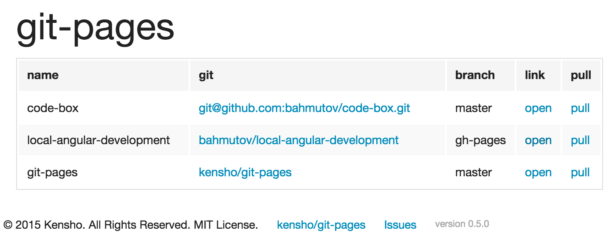

# git-pages

> Run your own github-like static pages

[![NPM][git-pages-icon] ][git-pages-url]

[![Build status][git-pages-ci-image] ][git-pages-ci-url]
[![dependencies][git-pages-dependencies-image] ][git-pages-dependencies-url]
[![devdependencies][git-pages-devdependencies-image] ][git-pages-devdependencies-url]
[![semantic-release][semantic-image] ][semantic-url]

[git-pages-icon]: https://nodei.co/npm/git-pages.png?downloads=true
[git-pages-url]: https://npmjs.org/package/git-pages
[git-pages-ci-image]: https://travis-ci.org/kensho/git-pages.png?branch=master
[git-pages-ci-url]: https://travis-ci.org/kensho/git-pages
[git-pages-dependencies-image]: https://david-dm.org/kensho/git-pages.png
[git-pages-dependencies-url]: https://david-dm.org/kensho/git-pages
[git-pages-devdependencies-image]: https://david-dm.org/kensho/git-pages/dev-status.png
[git-pages-devdependencies-url]: https://david-dm.org/kensho/git-pages#info=devDependencies
[semantic-image]: https://img.shields.io/badge/%20%20%F0%9F%93%A6%F0%9F%9A%80-semantic--release-e10079.svg
[semantic-url]: https://github.com/semantic-release/semantic-release

[Demo on Heroku](http://git-pages.herokuapp.com/) - might be asleep.

We love [Github pages](https://pages.github.com/) - a great way to show small JS / HTML library in action.
A lot of our public repos have them, but what about the private repos? There is no way (aside from 
buying [Github Enterprise](https://enterprise.github.com/features)) to have *privately hosted* static
pages from a list of your private repos. Unless you use **git-pages**! Just install, put names of
repos into a config file and start using Node.



The main index page shows list of pulled repos. Click on the "open" link to open the statically hosted
site pointing at the desired branch. Click "pull" to fetch the latest code.

## Install

* Install globally `npm install -g git-pages` to run as a CLI in any folder
* Install as a dependency `npm install --save git-pages` to start as NPM script from another project

## Serve single repo

If you just need to pull a repo and statically serve a single file, use command line arguments.
For example to serve the RevealJs presentation from https://github.com/kubawalinski/ndc2015-testjs
you can execute this command

    git-pages --repo git@github.com:kubawalinski/ndc2015-testjs.git --page slides-testjs.html

Run `git-pages --help` to see all options and shortcuts.

## Configure

Create `git-pages.configure.js` file that exports the configuration options, for example,
here are 2 repos to be hosted under `http://localhost:8765/code-box` and
`http://localhost:8765/local-angular`.

```js
module.exports = {
  repos: {
    'code-box': {
      // you can use full git@ url
      git: 'git@github.com:bahmutov/code-box.git',
      // or the full HTTPS url
      // git: 'https://github.com/bahmutov/code-box.git',
      // pick the index page from the repo, supports HTML, Markdown, Jade
      index: 'demo.html' // default is index.html,
      exec: 'npm install' // command to execute after pulling latest code, optional
    },
    'local-angular': {
      git: 'bahmutov/local-angular-development',
      branch: 'gh-pages' // pick branch other than master
    },
    'local-folder': {
      // copy and serve a local folder instead of Git repo
      folder: '/path/to/foo'
    }
  },
  storagePath: '/tmp/git-pages', // local temp folder, optional, leave it to OS tmp dir
  port: 8765 // serving port, optional
};
```

For our example, see [git-pages.config.js](git-pages.config.js)

Note: some hosting environments, like Heroku do not support pulling repos via SSH without additional setup, 
thus they require HTTPS git urls.

## Run

Run after installing globally `git-pages`

Run after installing as a dependency (via package.json script)

```json
"scripts": {
    "pages": "git-pages"
},
"dependencies": {
    "git-pages": "0.2.0"
}
```

Then you can start the `git-pages` server by simply `npm run pages`.

Run from the cloned folder

* simple start `node index.js` or `npm run start`
* run with automatic restart and watching source files `npm run watch`. 
Uses [nodemon](http://nodemon.io/).

## Todo

* [ ] webhook to allow pulling on commit
* [x] execute shell commands after pulling, for example `npm install` or `bower install`
* [x] form full SSH or HTTPS urls from user / repo name pair

### Small print

Author: Kensho &copy; 2015

* [@kensho](https://twitter.com/kensho)
* [kensho.com](http://kensho.com)

Support: if you find any problems with this library,
[open issue](https://github.com/kensho/git-pages/issues) on Github

## MIT License

The MIT License (MIT)

Copyright (c) 2015 Kensho

Permission is hereby granted, free of charge, to any person obtaining a copy of
this software and associated documentation files (the "Software"), to deal in
the Software without restriction, including without limitation the rights to
use, copy, modify, merge, publish, distribute, sublicense, and/or sell copies of
the Software, and to permit persons to whom the Software is furnished to do so,
subject to the following conditions:

The above copyright notice and this permission notice shall be included in all
copies or substantial portions of the Software.

THE SOFTWARE IS PROVIDED "AS IS", WITHOUT WARRANTY OF ANY KIND, EXPRESS OR
IMPLIED, INCLUDING BUT NOT LIMITED TO THE WARRANTIES OF MERCHANTABILITY, FITNESS
FOR A PARTICULAR PURPOSE AND NONINFRINGEMENT. IN NO EVENT SHALL THE AUTHORS OR
COPYRIGHT HOLDERS BE LIABLE FOR ANY CLAIM, DAMAGES OR OTHER LIABILITY, WHETHER
IN AN ACTION OF CONTRACT, TORT OR OTHERWISE, ARISING FROM, OUT OF OR IN
CONNECTION WITH THE SOFTWARE OR THE USE OR OTHER DEALINGS IN THE SOFTWARE.
